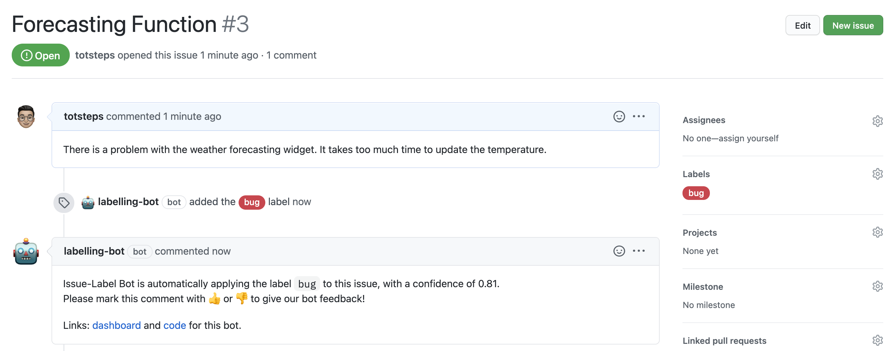

# labelling-bot
LabelBot is a Github application that can be used to automatically tag an issue with a Github label.
It uses machine learning to read the comment body and title to estimate what the issue might be about, and then labels the issue following the publishing of a short comment notifying the issue creator of the same.

When an issue is opened, the bot predicts if the label should be a:
`🐞 bug`, `💡 enhancement` or `? question` and applies it automatically if appropriate.

## Setup

```sh
# Install dependencies
yarn install or npm install

# Run the bot
yarn start or npm start
```

## Docker

```sh
# 1. Build container
docker build -t labelling-bot .

# 2. Start container
docker run -e APP_ID=<app-id> -e PRIVATE_KEY=<pem-value> labelling-bot
```

### Bot in action on Github


## Contributing

If you have suggestions for how `labelling-bot` could be improved, or want to report a bug, open an issue!
We'd love all and any contributions.
